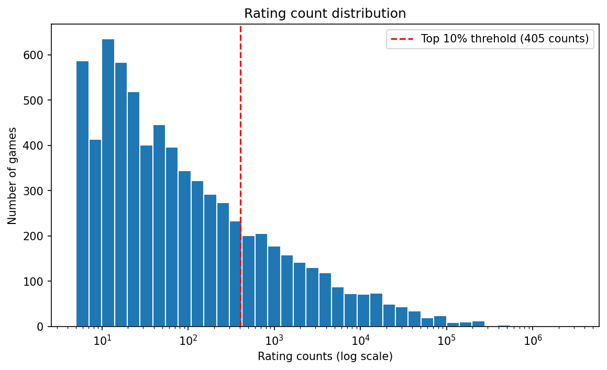
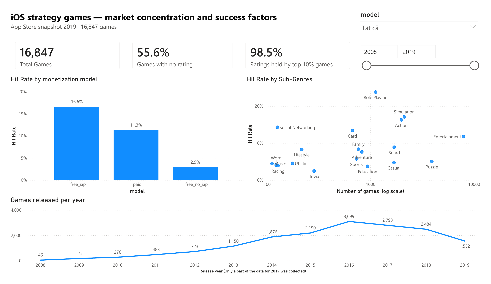

# iOS Strategy Games — Market Concentration & Success Factors


Market analysis of 16,847 strategy games on the Apple App Store.

**Main question:** how concentrated is the iOS strategy game market, and how do the most-rated games differ from the rest in two factors: monetization model and sub-genre?

---

## Dataset

- **Source:** [Kaggle — 17K Apple App Store Strategy Games](https://www.kaggle.com/datasets/tristan581/17k-apple-app-store-strategy-games), collected through the iTunes API
- **Size:** 17,007 rows, 18 columns, one row per game
- **Snapshot:** US App Store, 2019

The data has no downloads or revenue. **Rating count** is used as a proxy for how popular a game is.

---

## Tools

BigQuery SQL · Python (Colab) · Power BI

---

## Metric definitions

| Metric | Definition |
| --- | --- |
| Rating count | Number of user ratings; missing is treated as 0 |
| Tier | `no_rating` (0 ratings) / `rated` / `top_10pct` (405+ ratings, the top 10% by rating count) |
| Model | `paid` (price > 0) / `free_iap` (free with in-app purchases) / `free_no_iap` (free, no IAP) |
| Hit rate | % of games in a group that are `top_10pct`. The market-wide hit rate is 10% by definition |

---

## Data quality

- **160 exact duplicate rows** were removed, leaving **16,847 games**.
- **55.5% of games have no rating count.** The smallest rating count in the data is 5, which means the App Store only shows ratings once a game has at least 5. `no_rating` therefore really means "fewer than 5 ratings".
- **24 games have no price** and are treated as free.
- **Release dates run from July 2008 to October 2019.** 23 games were released after the 3 Aug 2019 collection date listed on Kaggle, so the data was actually collected later.

**Scope:** every game is kept, including those with no ratings.

---

## Exploration

- **83.6% of games are free.** The most common price for paid games is $0.99.
- **Popularity has a very long tail:** the median rating count is 0, while Clash of Clans has over 3 million.
- **More-rated games also score higher:** 3.88 stars on average under 100 ratings, 4.33 stars at over 1000 ratings
- **About 37% of games were never updated** after release.

---

## Market concentration

| Tier | Games | % of games | % of all ratings |
| --- | --- | --- | --- |
| no_rating | 9,359 | 55.6% | 0.0% |
| rated | 5,803 | 34.4% | 1.5% |
| **top_10pct** | **1,685** | **10.0%** | **98.5%** |

**The top 10% of games hold 98.5% of all ratings.** On the other hand, more than half of all games never reach 5 ratings.

**Ten games alone account for 30.4% of all ratings**, and Clash of Clans for 12.2%. By company, **Supercell holds 19% with just three games**, and the top 10 developers hold about 36%.

**A new game's chance of reaching the top keeps shrinking.** Releases per year peaked at about 3,100 games in 2016, while the hit rate fell from 50–63% for 2008–2009 releases to about 6% from 2015 on. Part of that drop is because older games have had more time to collect ratings, and older games that failed may have already been removed from the store.



---

## Monetization model

| Model | Games | % of market | % of top 10% | Hit rate | % with no rating |
| --- | --- | --- | --- | --- | --- |
| **free_iap** | 7,041 | 41.8% | **69.4%** | **16.6%** | 40.2% |
| paid | 2,739 | 16.3% | 18.4% | 11.3% | 55.5% |
| free_no_iap | 7,067 | 41.9% | 12.2% | 2.9% | 70.9% |

**The two free groups are the same size but end up in very different places.** Free games with IAP make up 69% of the top 10%, free games without IAP only 12%. The hit rate of the IAP group is about 6x higher.

**The gap is in popularity, not satisfaction.** `free_iap` games hold 82.4% of all ratings but average ratings across the three models are close: 4.16 / 4.01 / 3.90.

This is not a cause. The more likely story is that bigger, better-funded games choose free-to-play with IAP from the start — not that adding IAP makes a game succeed.

---

## Sub-genre

A game can belong to several genres and is counted in each. The "Games" and "Strategy" labels are dropped because every game has them, and only genres with 100+ games are kept (19 genres).

The scatter in the dashboard below places each genre by **number of games** (x-axis, log scale — how crowded it is) and **hit rate** (y-axis — how often a game becomes a hit). The dashed line marks the 10% market-wide hit rate, which splits the genres into four groups:

| Group | Genres | What it means |
| --- | --- | --- |
| Fewer games, above 10% | **Role Playing** (1,122 games, **23.8%**), Social Networking (14.3%), Card (13.4%) | Less crowded, above-average chance of success |
| Many games, above 10% | Simulation (17.1%), Action (16.3%), Entertainment (11.8%) | Large and performing well |
| Many games, below 10% | **Puzzle** (3,919 games, **5.1%**), Board (8.9%), Casual (4.7%) | Crowded but few hits |
| Fewer games, below 10% | Family, Adventure, Sports, Education, Trivia, Word, Racing, Music… | Small niches that rarely produce hits |

**Role Playing stands out:** its hit rate is about 4.5x Puzzle's, with roughly a quarter as many games. **Puzzle is the most crowded genre outside the broad "Entertainment" label**, yet only about 1 in 20 Puzzle games becomes a hit.

Two caveats. Role Playing's high hit rate may partly reflect its monetization mix: it has the highest share of `free_iap` games of any genre (64.9%). And genre hit rates are not adjusted for release year, so a genre with many older games can look more successful than it is for a new release today

---



---

## Recommendations

- **Go free-to-play with IAP to compete at the top.** Nearly 70% of top-10% games use this model; free games without IAP rarely break through.
- **Look at Role Playing; be wary of Puzzle and Casual.** Role Playing keeps a high hit rate even for recent releases, while Puzzle and Casual have many games and very few hits.
- **Treat visibility as the first hurdle.** More than half of all games never reach 5 ratings, yet about 405 ratings is enough to enter the top 10%. A launch plan should aim squarely at those first ratings.

---

## Limitations

- 2019 snapshot, US App Store and iOS only. 2019 is a partial year.
- Rating count is not downloads or revenue.
- Games removed from the store are missing, which makes older games look more successful than they were.
- Tiers are defined by rating count, which is the outcome being studied.
- A game is counted in several genres; "Entertainment" is a very broad label found on almost half of all games.
- Descriptive only — no statistical tests, and no finding in this project is claimed as causal.

---

## What I would do next

- **Number of languages and update frequency vs. success.** Watch for reverse causality: successful games are the ones that can afford translation and frequent updates.
- **Adjust for game age**, e.g. ratings per year since release, to compare old and new games fairly.

---

## Repository

```
├── README.md
├── sql/
│   ├── 01_data_quality.sql
│   ├── 02_data_exploration.sql
│   ├── 03_prepare.sql
│   ├── 04_market_concentration.sql
│   ├── 05_monetization.sql
├── notebooks/
│   └── strategy_games_analysis.ipynb
├── dashboard/
│   └── strategy_games.pbix
└── screenshots/
    ├── dashboard.png
    └── rating_count_distribution.png
```

## How to run

1. Download `appstore_games.csv` from the link
2. Load it into BigQuery as `game_analytics.strategy_games`
3. Run `sql/01` through `sql/05` in order
4. Open `notebooks/strategy_games_analysis.ipynb` in Colab, upload the CSV and run it to cross-check the results in Pandas
